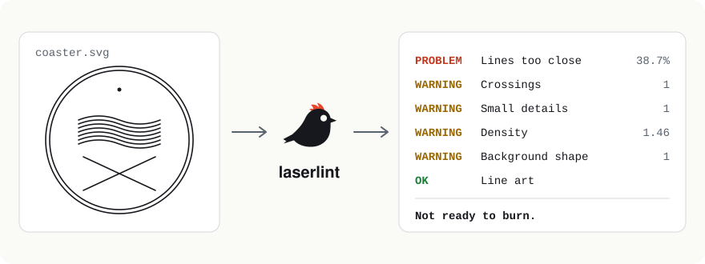

<p align="center">
  <picture>
    <source media="(prefers-color-scheme: dark)" srcset="docs/images/laserlint-hero-dark.svg">
    
  </picture>
</p>

<p align="center">
  <a href="https://github.com/kinglet-dev/laserlint/actions/workflows/ci.yml"></a>
  <a href="https://github.com/kinglet-dev/laserlint/actions/workflows/badges.yml"></a>
  <a href="https://github.com/kinglet-dev/laserlint/releases/latest"></a>
  <a href="LICENSE"></a>
  <a href="go.mod"></a>
</p>

# laserlint

**Checks an SVG before you laser it:** score lines too close together, lines that cross, details too small to survive, areas packed too densely, white backgrounds that burn a frame, and line art that burns as double lines.

It works on the design at the size saved in the file, runs on your computer, and never changes the file.

[Documentation](#usage) · [kinglet.dev](https://kinglet.dev/tools/laserlint/) · [Changelog](CHANGELOG.md) · [Security](SECURITY.md) · [Releases](https://github.com/kinglet-dev/laserlint/releases)

## Example

[`examples/coaster.svg`](examples/coaster.svg) is a 60 mm coaster with some typical problems:

```text
$ laserlint coaster.svg
laserlint 0.1.0 · coaster.svg · 60.0 × 60.0 mm · line 0.10 mm · gap 0.25 mm

PROBLEM  Lines too close
         38.7% of scored line is within 0.35 mm of other line, centre to centre (limit 10%); nearest 0.02 mm
         Where: (30.0, 40.0), (43.7, 24.7), (43.7, 26.2), (43.7, 27.7), (16.1, 23.9) mm from the top-left
         Fix: Space lines at least 0.35 mm apart, centre to centre, or remove fine detail; blunt or shorten very sharp points.
WARNING  Crossings
         1 place where score lines cross or one ends on another, burning twice (problem above 50)
         Where: (30.0, 40.0) mm from the top-left
         Fix: Combine overlapping shapes into one outline (Inkscape: Path → Union), or trim lines to stop where they meet.
WARNING  Small details
         1 closed shape under 0.50 mm across burns as a dot (problem above 20); smallest 0.30 mm
         Where: (30.0, 14.0) mm from the top-left
         Fix: Delete specks and slivers, or enlarge details to at least 0.50 mm across; where overlapping shapes leave slivers, combine them (Inkscape: Path → Union).
WARNING  Density
         densest 10 mm area has 1.46 mm of line per mm² (lines about 0.69 mm apart); warning above 0.9, problem above 2
         Where: (30.0, 27.5) mm from the top-left
         Fix: Simplify or spread out the busiest area, or remove fine detail there.
WARNING  Background shape
         a white background shape (60.0 × 60.0 mm) is scored around its edge like any other shape
         Where: (30.0, 30.0) mm from the top-left
         Fix: Delete it before burning; hiding it isn't enough, as laser software such as xTool Creative Space burns hidden layers too.
OK       Line art

Not ready to burn: 1 problem and 4 warnings.
```

Positions are in millimetres from the design's top-left corner. The exit status is 1, so a script can stop before burning.

## Installation

laserlint is a single program with no other software to install.

1. Download the file for your computer from the [latest release](https://github.com/kinglet-dev/laserlint/releases/latest):

   | Computer | File |
   |---|---|
   | Windows (most PCs) | `laserlint_<version>_windows_amd64.zip` |
   | Windows on Arm | `laserlint_<version>_windows_arm64.zip` |
   | Mac with Apple silicon (M1 and later) | `laserlint_<version>_darwin_arm64.tar.gz` |
   | Mac with Intel | `laserlint_<version>_darwin_amd64.tar.gz` |
   | Linux | `laserlint_<version>_linux_amd64.tar.gz` or `_linux_arm64.tar.gz` |

2. Unpack it and put `laserlint` (`laserlint.exe` on Windows) in a folder on your `PATH`, or run it from where it is.
3. Check it runs: `laserlint --version`.

The programs aren't signed with an Apple or Microsoft certificate yet. On a Mac, if macOS says it can't check the program, run `xattr -d com.apple.quarantine laserlint` once. On Windows, SmartScreen may ask you to confirm the first time.

**Verify a download (optional):** each release has a `laserlint_<version>_checksums.txt` file. Compare it with `sha256sum laserlint_*` (Linux), `shasum -a 256 laserlint_*` (macOS) or `Get-FileHash laserlint_*` (PowerShell). Each archive also has an SBOM (`.sbom.json`) listing what it's built from.

**From source:** with [Go](https://go.dev/dl/) 1.27 or later, run `go install github.com/kinglet-dev/laserlint/cmd/laserlint@latest`.

## Usage

```text
laserlint [flags] FILE
laserlint [flags] -          read the SVG from standard input
```

Scale the design to the size you'll burn before checking: the size saved in the file is the size that's checked.

### What it checks

| Check | What it finds | Warning | Problem |
|---|---|---|---|
| Lines too close | Scored line within line + gap (0.35 mm) of other line; lines merge into a smudge | from 1% of the line | above 10% |
| Crossings | Lines that cross or end on another line, and line drawn on top of other line; those spots burn twice | any | above 50 crossings or 2 mm stacked |
| Small details | Closed shapes under 0.5 mm across, which burn as dots | any | above 20 |
| Density | The busiest 10 mm × 10 mm area, in mm of line per mm²; heat builds up and chars | above 0.9 | above 2 |
| Background shape | A white shape covering the design; laser software still scores its edge | yes | — |
| Line art | Most of the line is the two edges of thin black strokes, so each stroke burns twice | information only | — |

Laser software such as xTool Creative Space scores every outline of a filled shape and the line of every hairline, whatever the colour, and it includes hidden layers. laserlint reads the SVG the same way.

### Flags

| Flag | Meaning | Default |
|---|---|---|
| `--line LENGTH` | Width of a scored line | `0.10mm` |
| `--gap LENGTH` | Clear gap needed between the edges of two lines | `0.25mm` |
| `--warn-close PCT` | Warn when this share of line is too close | `1%` |
| `--max-close PCT` | A problem when more than this share is too close | `10%` |
| `--detail LENGTH` | Smallest closed shape that survives, across | `0.5mm` |
| `--max-details N` | A problem when more closed shapes than this are smaller than `--detail` | `20` |
| `--max-crossings N` | A problem when lines cross in more places than this | `50` |
| `--max-stacked LENGTH` | A problem when more line than this lies on other line | `2mm` |
| `--warn-density N` | Warn above this many mm of line per mm² | `0.9` |
| `--max-density N` | A problem above this many mm of line per mm² | `2` |
| `--json` | Write the report as JSON | off |
| `--version`, `--help` | Show the version or help | |

Lengths need a unit: `mm`, `cm`, `in`, `pt` or `px`. A bare number is refused, so nothing is guessed. The defaults suit an xTool D1 Pro or P2 diode laser on plywood; set `--line` and `--gap` for your machine and material.

### Examples

```sh
laserlint coaster.svg
laserlint --line 0.08mm --gap 0.3mm coaster.svg
laserlint --json coaster.svg > report.json
cat coaster.svg | laserlint -
```

### Exit status

| Code | Meaning |
|---|---|
| 0 | Ready to burn (warnings and information allowed) |
| 1 | Problems found |
| 2 | The file couldn't be checked; the message says why and how to fix it |

### JSON report

`--json` writes a stable, versioned report, `kinglet.report/v1`: the tool, the input's size, the settings used, every check that ran, and each finding with its check, severity (`problem`, `warning`, `info`), message, fix and locations in mm. Within a major version it only changes in backwards-compatible ways.

## Compatibility

- **Systems:** Windows, macOS and Linux, on 64-bit Intel/AMD (`amd64`) and Arm (`arm64`). Tested on all three in CI.
- **SVG:** `path` (all commands, including arcs), `rect`, `circle`, `ellipse`, `line`, `polyline`, `polygon` and groups, with transforms, `viewBox`, sizes in any unit, and colours from attributes or the `style` attribute. Checked against files from Illustrator, Inkscape, potrace and online converters.
- **Not read yet:** clones (`<use>`), text, embedded images and CSS classes. laserlint stops with the Inkscape fix: Edit → Clone → Unlink Clone, or Path → Object to Path.
- **Limits:** files up to 25 MB and 200,000 elements, so a hostile file can't hang it.

## Configuration

None: there's no configuration file. Everything is set with the flags above.

## Dependencies

laserlint uses only the Go standard library. Its tests use [Ginkgo](https://github.com/onsi/ginkgo) and [Gomega](https://github.com/onsi/gomega) (both MIT), which aren't part of the program.

It needs no network connection and sends nothing anywhere.

## Contributing

Issues, bug reports and sample SVGs are very welcome. Outside pull requests need a signed Contributor License Agreement, which isn't set up yet; see [CONTRIBUTING.md](CONTRIBUTING.md).

## Security

Please report vulnerabilities privately, as described in [SECURITY.md](SECURITY.md).

## Licence

laserlint is released under the [MIT Licence](LICENSE). The Kinglet name, logo and mascot aren't covered by it; see [TRADEMARKS.md](TRADEMARKS.md).
